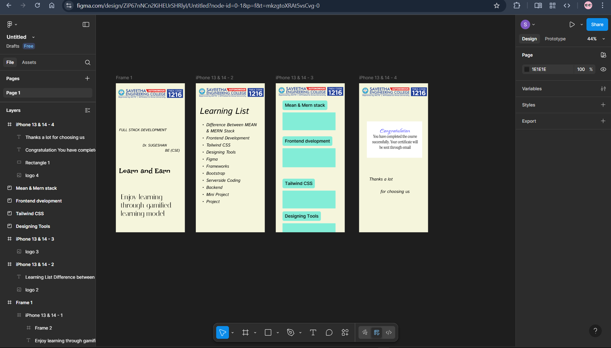

# Ex09 Event Registration Web Application
## Date: 15.05.2025

## AIM:
To design, develop and deploy a web application for event registration.

## DESIGN STEPS:

### Step 1:
Create a new frame.

### Step 2:
Select any one preset size of your choice.

### Step 3:
Select the shapes you need.

### Step 4:
Import images as needed.

### Step 5:
Create pages based on your need and link them.

### Step 6:

Validate the HTML and CSS code.

### Step 6:

Publish the website in the given URL.

## DESIGN TOOL:
Figma

## CODE:
page1
```
<div style="width: 390px; height: 844px; position: relative">
  <div style="width: 390px; height: 844px; left: 0px; top: 0px; position: absolute; background: #F5F5DC; overflow: hidden">
    
    <div style="width: 363px; height: 145px; left: 18px; top: 251px; position: absolute; color: black; font-size: 20px; font-family: Istok Web; font-style: italic; font-weight: 700; word-wrap: break-word">FULL STACK DEVELOPMENT <br/><br/>                                           <br/>                    Dr. SUGESHAN    <br/>                                       BE (CSE)                                                     </div>
    <div style="width: 354px; height: 37px; left: 18px; top: 472px; position: absolute; color: black; font-size: 40px; font-family: Irish Grover; font-weight: 400; word-wrap: break-word">Learn and Earn</div>
    <div style="width: 342px; height: 161px; left: 28px; top: 620px; position: absolute; color: black; font-size: 40px; font-family: Italiana; font-weight: 400; word-wrap: break-word">Enjoy learning through gamified learning model</div>
    <div style="width: 100px; height: 100px; left: 268px; top: 429px; position: absolute"></div>
  </div>
</div>

import React from "react";
import styled from "styled-components";

const StyledLogo1 = styled.div`
  width: 378.98px;
  height: 57px;
  left: 7px;
  top: 30px;
  position: absolute;
`;

const StyledFullstackdevelopmentdrsugeshanbecsespan = styled.span`
  color: black;
  font-size: 20px;
  font-family: Istok Web;
  font-style: italic;
  font-weight: 700;
  word-wrap: break-word;
`;

const StyledLearnandearnspan = styled.span`
  color: black;
  font-size: 40px;
  font-family: Irish Grover;
  font-weight: 400;
  word-wrap: break-word;
`;

const StyledEnjoylearningthroughgamifiedlearningmodelspan = styled.span`
  color: black;
  font-size: 40px;
  font-family: Italiana;
  font-weight: 400;
  word-wrap: break-word;
`;

const StyledFrame2 = styled.div`
  width: 100px;
  height: 100px;
  left: 268px;
  top: 429px;
  position: absolute;
`;

const StyledIPhone13141 = styled.div`
  width: 390px;
  height: 844px;
  left: 0px;
  top: 0px;
  position: absolute;
  background: #F5F5DC;
  overflow: hidden;
`;

const StyledFrame1 = styled.div`
  width: 390px;
  height: 844px;
  position: relative;
`;

export const Frame1 = () => {
  return (
    <StyledFrame1>
      <StyledIPhone13141>
        <StyledLogo1  src="https://placehold.co/379x57"/>
        <StyledFULLSTACKDEVELOPMENTDrSUGESHANBECSE>FULL STACK DEVELOPMENT <br/><br/>                                           <br/>                    Dr. SUGESHAN    <br/>                                       BE (CSE)                                                     </StyledFULLSTACKDEVELOPMENTDrSUGESHANBECSE>
        <StyledLearnandEarn>Learn and Earn</StyledLearnandEarn>
        <StyledEnjoylearningthroughgamifiedlearningmodel>Enjoy learning through gamified learning model</StyledEnjoylearningthroughgamifiedlearningmodel>
        <StyledFrame2 />
      </StyledIPhone13141>
    </StyledFrame1>
  );
};
```
page2
```
<div style="width: 390px; height: 844px; position: relative; background: #F5F5DC; overflow: hidden">
  
  <div style="width: 334px; height: 654px; left: 23px; top: 125px; position: absolute"><span style="color: black; font-size: 48px; font-family: Istok Web; font-style: italic; font-weight: 700; word-wrap: break-word">Learning List<br/></span><span style="color: black; font-size: 24px; font-family: Istok Web; font-style: italic; font-weight: 700; word-wrap: break-word"><br/></span><span style="color: black; font-size: 24px; font-family: Istok Web; font-style: italic; font-weight: 700; text-transform: capitalize; word-wrap: break-word">Difference between MEAN & MERN stack<br/>Frontend development<br/>Tailwind CSS <br/>Designing tools<br/>Figma<br/>Frameworks<br/>Bootstrap<br/>Serverside coding<br/>Backend <br/>Mini Project<br/>Project</span></div>
</div>

import React from "react";
import styled from "styled-components";

const StyledLogo2 = styled.div`
  width: 378.98px;
  height: 57px;
  left: 11px;
  top: 24px;
  position: absolute;
`;

const StyledLearninglistdifferencebetweenmeanmernstackfrontenddevelopmenttailwindcssdesigningtoolsfigmaframeworksbootstrapserversidecodingbackendminiprojectprojectspan01 = styled.span`
  color: black;
  font-size: 48px;
  font-family: Istok Web;
  font-style: italic;
  font-weight: 700;
  word-wrap: break-word;
`;

const StyledLearninglistdifferencebetweenmeanmernstackfrontenddevelopmenttailwindcssdesigningtoolsfigmaframeworksbootstrapserversidecodingbackendminiprojectprojectspan02 = styled.span`
  color: black;
  font-size: 24px;
  font-family: Istok Web;
  font-style: italic;
  font-weight: 700;
  word-wrap: break-word;
`;

const StyledLearninglistdifferencebetweenmeanmernstackfrontenddevelopmenttailwindcssdesigningtoolsfigmaframeworksbootstrapserversidecodingbackendminiprojectprojectspan03 = styled.span`
  color: black;
  font-size: 24px;
  font-family: Istok Web;
  font-style: italic;
  font-weight: 700;
  text-transform: capitalize;
  word-wrap: break-word;
`;

const StyledIPhone13142 = styled.div`
  width: 390px;
  height: 844px;
  position: relative;
  background: #F5F5DC;
  overflow: hidden;
`;

export const Iphone13142 = () => {
  return (
    <StyledIPhone13142>
      <StyledLogo2  src="https://placehold.co/379x57"/>
      <StyledLearningListDifferencebetweenMEANMERNstackFrontenddevelopmentTailwindCSSDesigningtoolsFigmaFrameworksBootstrapServersidecodingBackendMiniProjectProject><StyledLearninglistdifferencebetweenmeanmernstackfrontenddevelopmenttailwindcssdesigningtoolsfigmaframeworksbootstrapserversidecodingbackendminiprojectprojectspan01>Learning List<br/></StyledLearninglistdifferencebetweenmeanmernstackfrontenddevelopmenttailwindcssdesigningtoolsfigmaframeworksbootstrapserversidecodingbackendminiprojectprojectspan01><StyledLearninglistdifferencebetweenmeanmernstackfrontenddevelopmenttailwindcssdesigningtoolsfigmaframeworksbootstrapserversidecodingbackendminiprojectprojectspan02><br/></StyledLearninglistdifferencebetweenmeanmernstackfrontenddevelopmenttailwindcssdesigningtoolsfigmaframeworksbootstrapserversidecodingbackendminiprojectprojectspan02><StyledLearninglistdifferencebetweenmeanmernstackfrontenddevelopmenttailwindcssdesigningtoolsfigmaframeworksbootstrapserversidecodingbackendminiprojectprojectspan03>Difference between MEAN & MERN stack<br/>Frontend development<br/>Tailwind CSS <br/>Designing tools<br/>Figma<br/>Frameworks<br/>Bootstrap<br/>Serverside coding<br/>Backend <br/>Mini Project<br/>Project</StyledLearninglistdifferencebetweenmeanmernstackfrontenddevelopmenttailwindcssdesigningtoolsfigmaframeworksbootstrapserversidecodingbackendminiprojectprojectspan03></StyledLearningListDifferencebetweenMEANMERNstackFrontenddevelopmentTailwindCSSDesigningtoolsFigmaFrameworksBootstrapServersidecodingBackendMiniProjectProject>
    </StyledIPhone13142>
  );
};

```

page3
```
<div style="width: 390px; height: 844px; position: relative; background: #F5F5DC; overflow: hidden">
  
</div>

import React from "react";
import styled from "styled-components";

const StyledLogo3 = styled.div`
  width: 379px;
  height: 57px;
  left: 9px;
  top: 18px;
  position: absolute;
`;

const StyledIPhone13143 = styled.div`
  width: 390px;
  height: 844px;
  position: relative;
  background: #F5F5DC;
  overflow: hidden;
`;

export const Iphone13143 = () => {
  return (
    <StyledIPhone13143>
      <StyledLogo3  src="https://placehold.co/379x57"/>
    </StyledIPhone13143>
  );
};
```
page4
```
<div style="width: 390px; height: 844px; position: relative; background: #F5F5DC; overflow: hidden">
  
  <div style="width: 313px; height: 206px; left: 44px; top: 216px; position: absolute; background: var(--Backgrounds-Primary, white)"></div>
  <div style="width: 267px; height: 151px; left: 70px; top: 248px; position: absolute; text-align: center"><span style="color: #0000FF; font-size: 40px; font-family: Island Moments; font-weight: 400; word-wrap: break-word">Congratulation<br/></span><span style="color: black; font-size: 24px; font-family: Instrument Serif; font-weight: 400; word-wrap: break-word">You have completed the course successfully. Your certificate will be sent through email</span></div>
  <div style="width: 267px; height: 77px; left: 70px; top: 527px; position: absolute; text-align: center; color: black; font-size: 24px; font-family: Istok Web; font-style: italic; font-weight: 400; word-wrap: break-word">  Thanks a lot                      <br/>                                 for choosing us</div>
</div>

import React from "react";
import styled from "styled-components";

const StyledLogo4 = styled.div`
  width: 379px;
  height: 57px;
  left: 11px;
  top: 20px;
  position: absolute;
`;

const StyledRectangle1 = styled.div`
  width: 313px;
  height: 206px;
  left: 44px;
  top: 216px;
  position: absolute;
  background: var(--Backgrounds-Primary, white);
`;

const StyledCongratulationyouhavecompletedthecoursesuccessfullyyourcertificatewillbesentthroughemailspan01 = styled.span`
  color: #0000FF;
  font-size: 40px;
  font-family: Island Moments;
  font-weight: 400;
  word-wrap: break-word;
`;

const StyledCongratulationyouhavecompletedthecoursesuccessfullyyourcertificatewillbesentthroughemailspan02 = styled.span`
  color: black;
  font-size: 24px;
  font-family: Instrument Serif;
  font-weight: 400;
  word-wrap: break-word;
`;

const StyledThanksalotforchoosingusspan = styled.span`
  color: black;
  font-size: 24px;
  font-family: Istok Web;
  font-style: italic;
  font-weight: 400;
  word-wrap: break-word;
`;

const StyledIPhone13144 = styled.div`
  width: 390px;
  height: 844px;
  position: relative;
  background: #F5F5DC;
  overflow: hidden;
`;

export const Iphone13144 = () => {
  return (
    <StyledIPhone13144>
      <StyledLogo4  src="https://placehold.co/379x57"/>
      <StyledRectangle1 />
      <StyledCongratulationYouhavecompletedthecoursesuccessfullyYourcertificatewillbesentthroughemail><StyledCongratulationyouhavecompletedthecoursesuccessfullyyourcertificatewillbesentthroughemailspan01>Congratulation<br/></StyledCongratulationyouhavecompletedthecoursesuccessfullyyourcertificatewillbesentthroughemailspan01><StyledCongratulationyouhavecompletedthecoursesuccessfullyyourcertificatewillbesentthroughemailspan02>You have completed the course successfully. Your certificate will be sent through email</StyledCongratulationyouhavecompletedthecoursesuccessfullyyourcertificatewillbesentthroughemailspan02></StyledCongratulationYouhavecompletedthecoursesuccessfullyYourcertificatewillbesentthroughemail>
      <StyledThanksalotforchoosingus>  Thanks a lot                      <br/>                                 for choosing us</StyledThanksalotforchoosingus>
    </StyledIPhone13144>
  );
};
```
## OUTPUT:



## RESULT:
The program to design, develop and deploy a web application for event registration is completed successfully.
